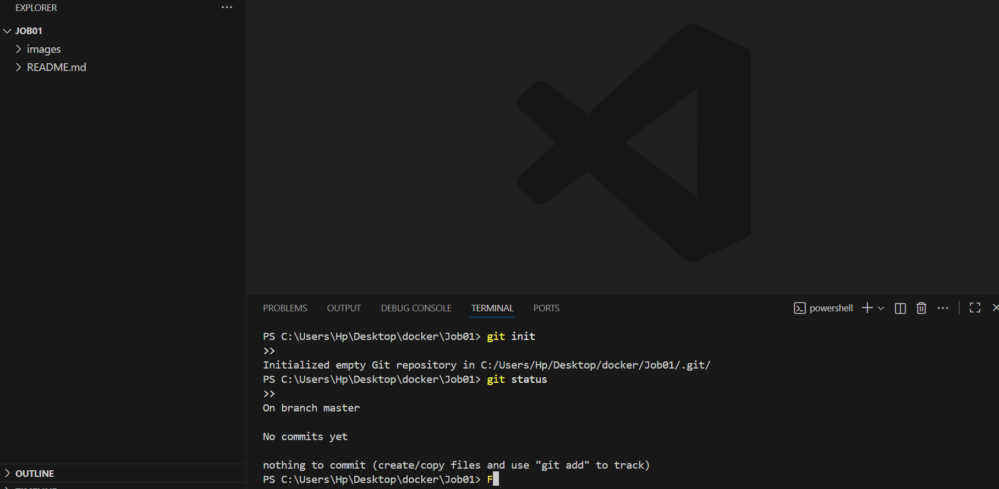
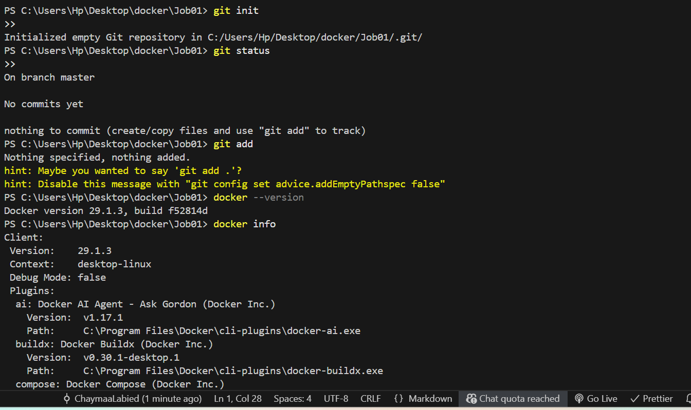
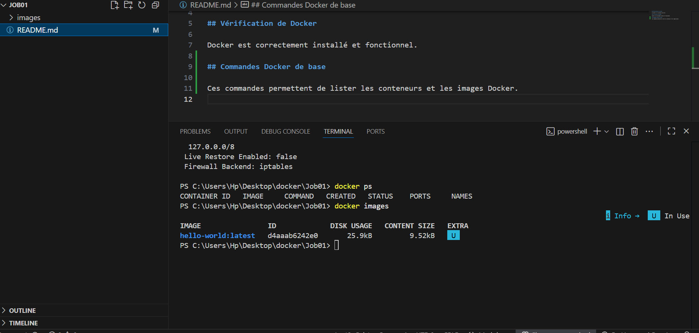
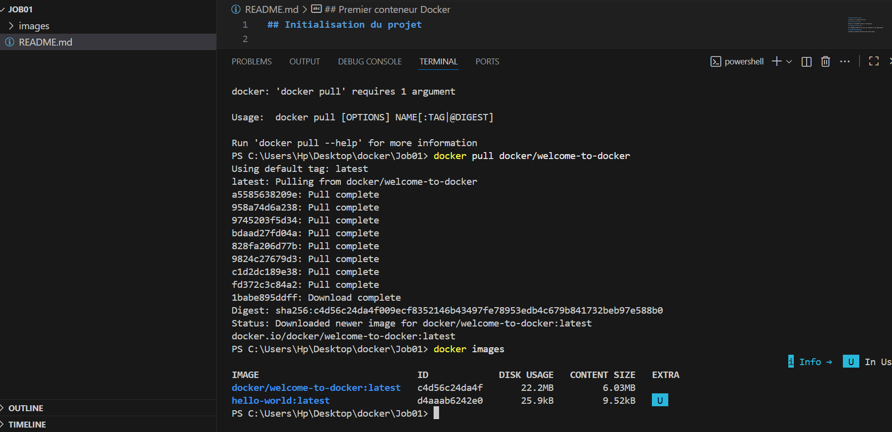
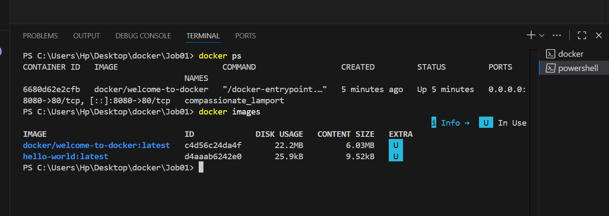
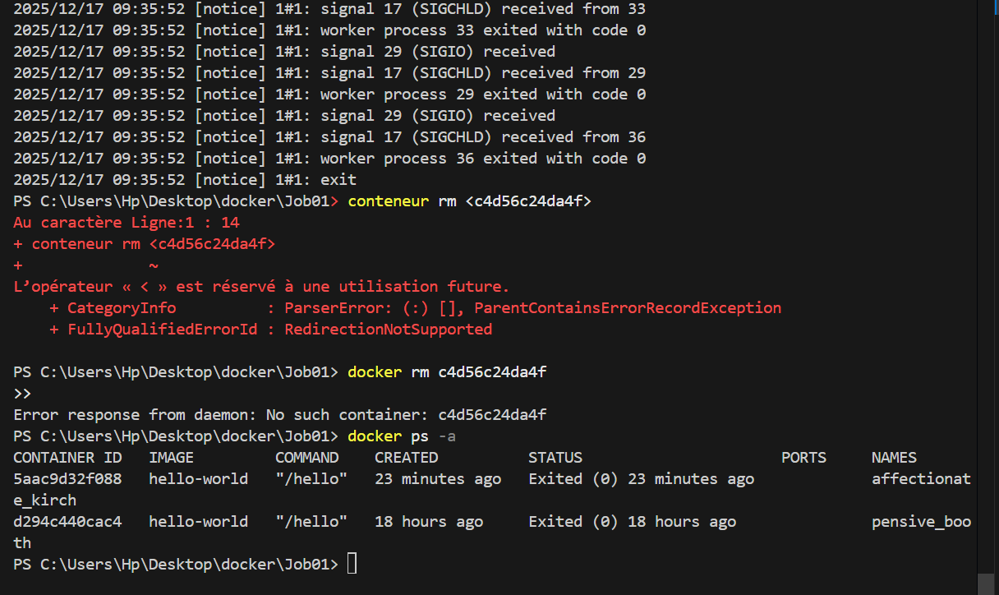
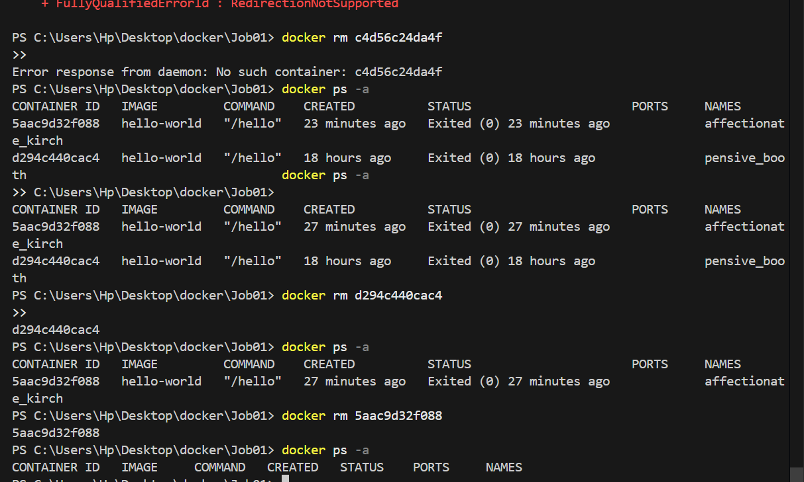

## Initialisation du projet

Le projet a été initialisé avec Git.

---

## Vérification de Docker

Docker est correctement installé et fonctionnel.

---

## Les commandes Docker de base

Ces commandes permettent de lister les conteneurs et les images Docker.

---

## Premier conteneur Docker

Lancement du conteneur hello-world pour tester Docker.

---

## Récupération de l'image welcome-to-docker

Téléchargement de l'image officielle Docker.

---

## Le lancement du conteneur welcome-to-docker

Le conteneur est accessible via le navigateur.

---

## Suppression d’un conteneur

Suppression manuelle d’un conteneur Docker arrêté.

---

## Suppression de tous les conteneurs arrêtés

La commande `docker container prune` permet de supprimer tous les conteneurs arrêtés.

---

## Suppression de l'image Docker hello-world

Après suppression des conteneurs, l'image peut être supprimée avec `docker rmi`.

