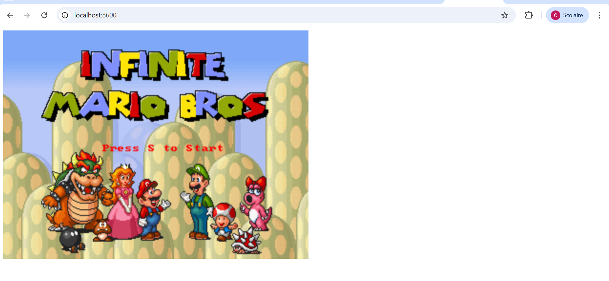
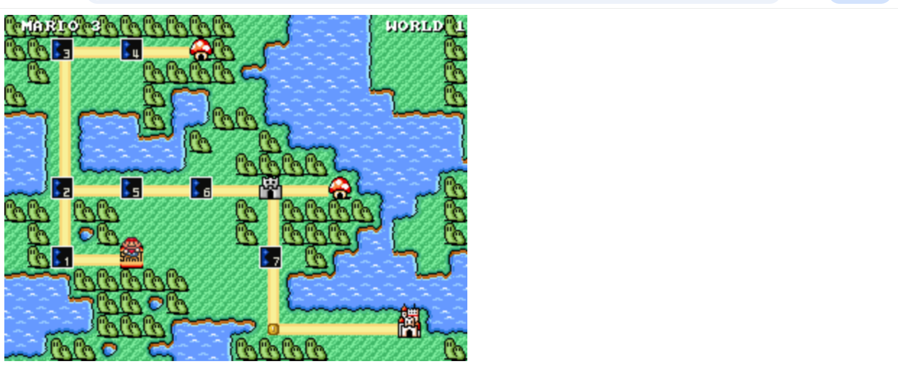
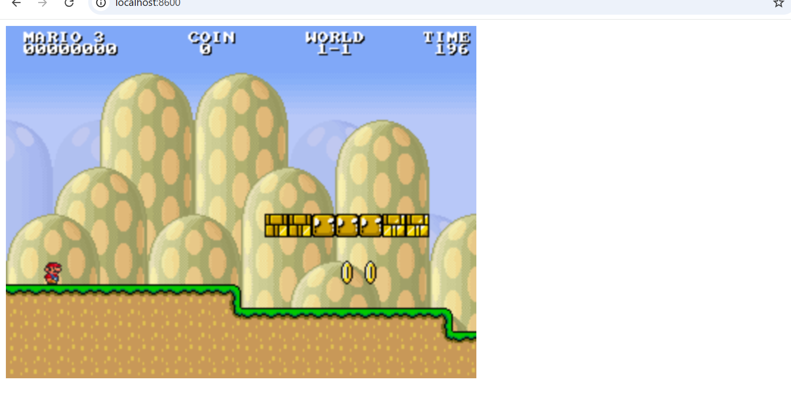
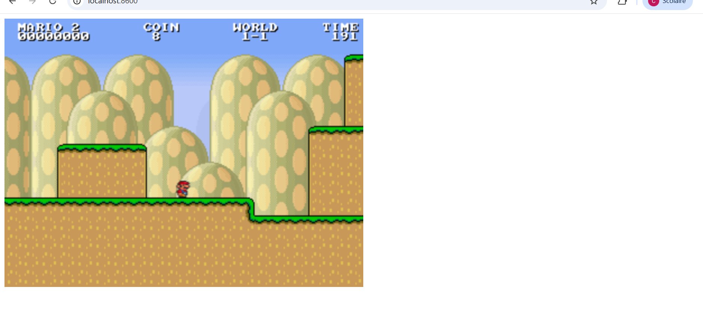
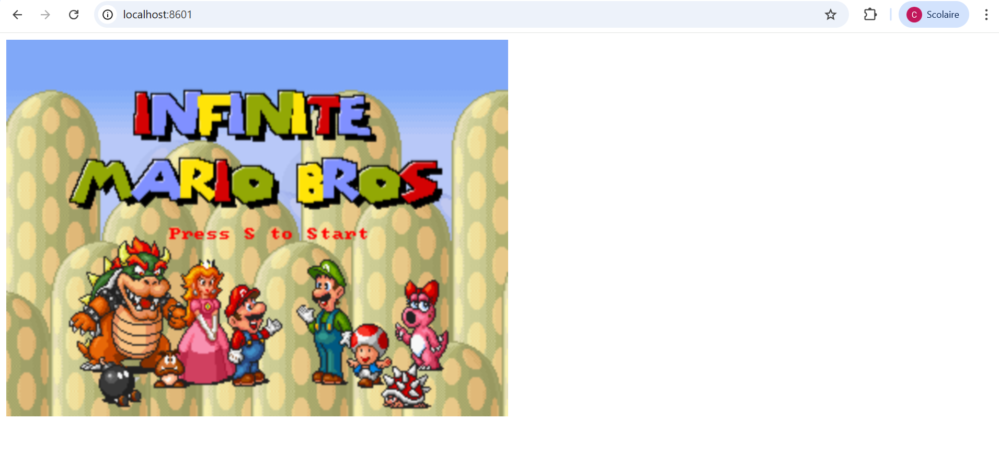

# TP Docker – Gestion des images (Super Mario)

## 🧩 Partie 1 — Images Docker

### Étape 1 — Recherche de l’image Docker

### Étape 2 — Téléchargement (pull) de l’image Docker

L’image Docker **phee13/supermario** a été téléchargée.

  

### Étape 3 — Lancement du conteneur et vérification dans Docker Desktop

Le conteneur a été lancé à partir de l’image téléchargée et est visible dans Docker Desktop.  
Les images et conteneurs sont accessibles dans les onglets **Images** et **Containers**.

  

🧩 Partie 2 — Containers Docker (Super Mario)

### Étape 1 — Lancer le conteneur depuis Docker Desktop

### Étape 2 — Lancer le conteneur depuis le terminal (option alternative)

### Étape 3 — Accéder au jeu dans le navigateur

### Étape 4 — Lancer un autre conteneur sur un port différent

