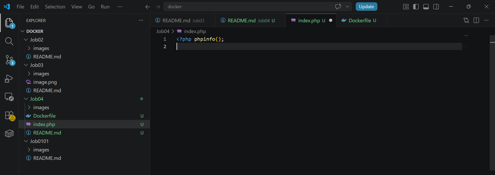
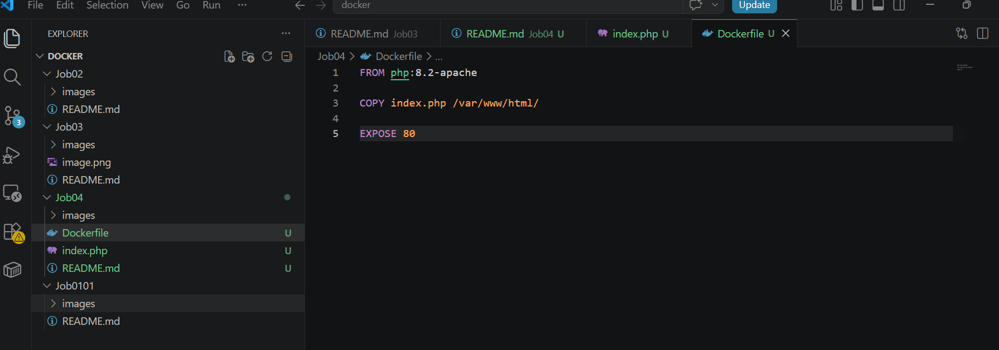
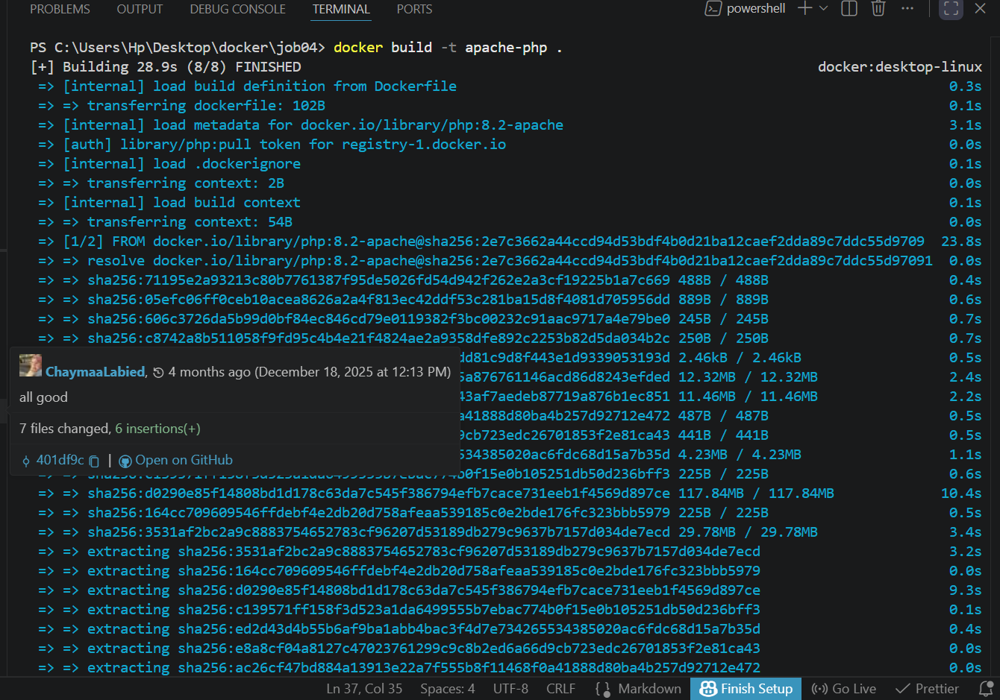
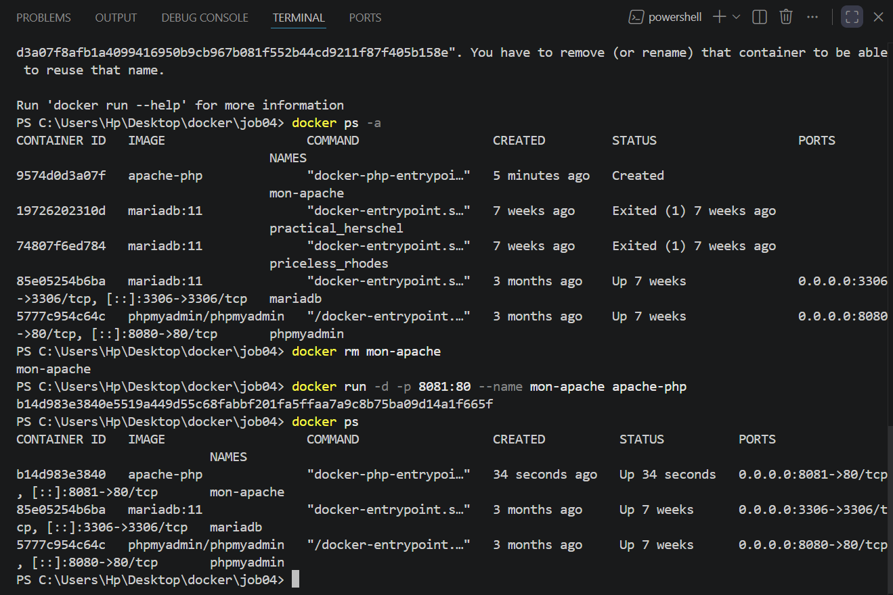
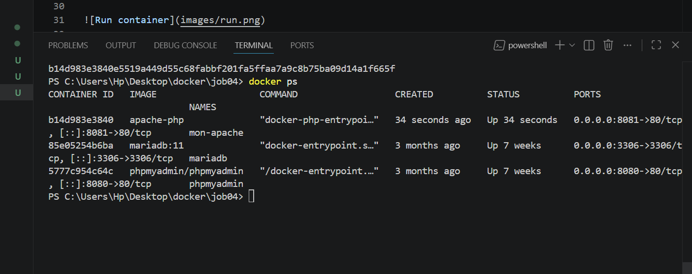
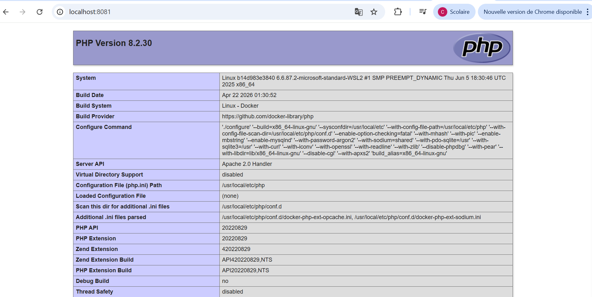
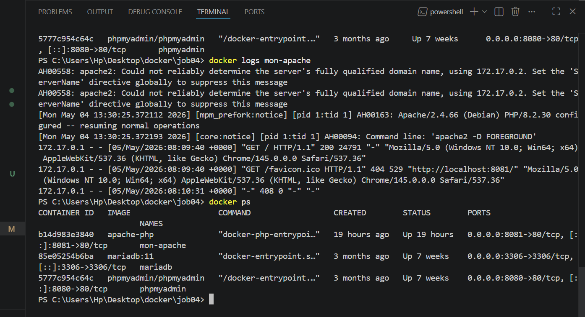
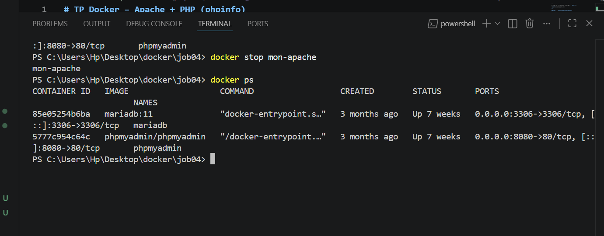

# TP Docker – Apache + PHP (phpinfo)

---

## Partie 1 — Création de l’environnement Apache + PHP

### Étape 1 — Création du fichier `index.php`

Création d’un fichier PHP permettant d’afficher les informations du serveur grâce à la fonction `phpinfo()`.



### Étape 2 — Création du Dockerfile

Création d’un fichier `Dockerfile` basé sur une image officielle PHP avec Apache intégré.

## 

## 🐳 Partie 2 — Construction et exécution du conteneur

### Étape 1 — Build de l’image Docker

Construction de l’image Docker à partir du Dockerfile.



### Étape 2 — Lancement du conteneur

Démarrage du conteneur avec redirection du port 8080 (machine locale) vers le port 80 (Apache dans le conteneur).



### Étape 3 — Vérification du conteneur en cours d’exécution

Affichage des conteneurs actifs pour vérifier que le serveur tourne correctement.



### Étape 4 — Accès à l’application via le navigateur

Accès à la page PHP via l’URL :

```
http://localhost:8081
```

Affichage des informations du serveur grâce à `phpinfo()`.



---

### Étape 5 — Consultation des logs (optionnel)

Vérification des logs du conteneur Apache.



### Étape 6 — Arrêt du conteneur

Arrêt du conteneur en cours d’exécution.


