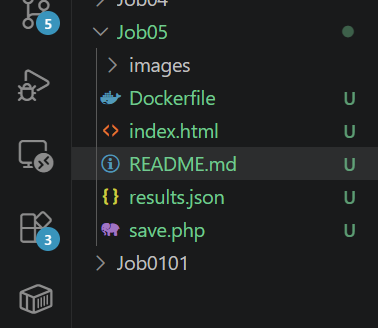
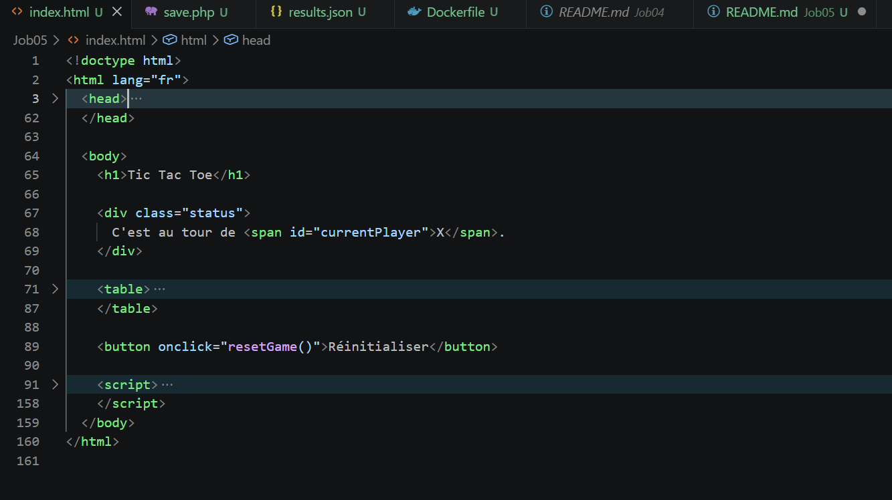
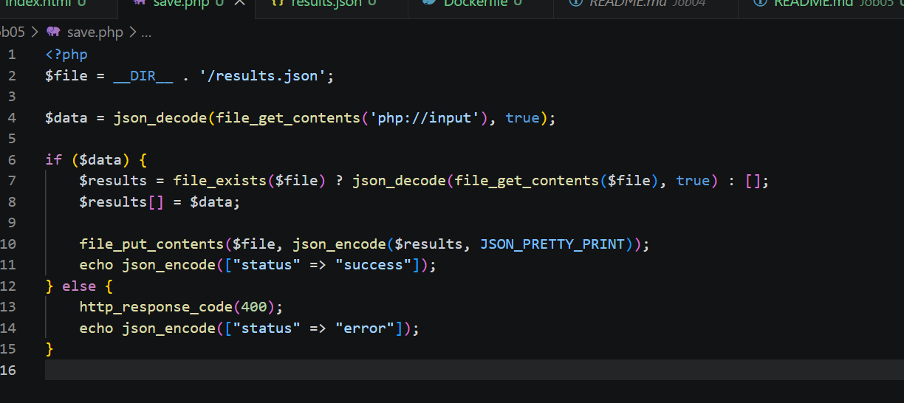
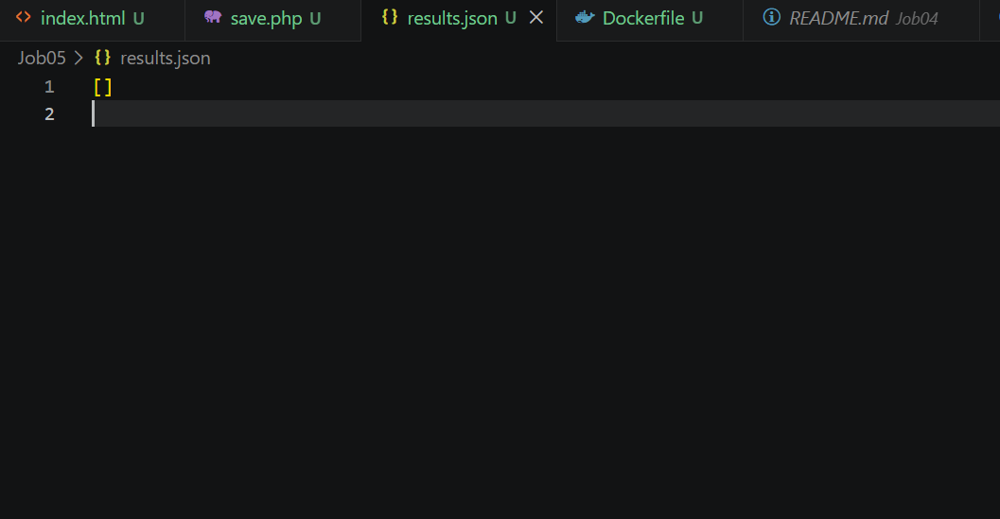
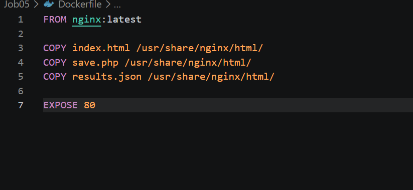
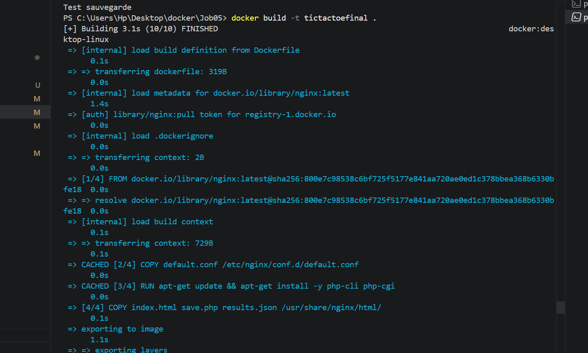
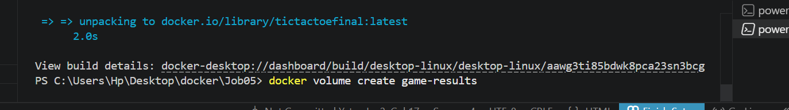
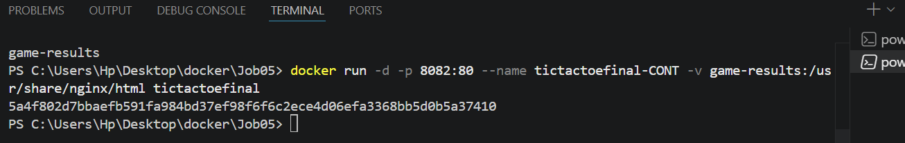
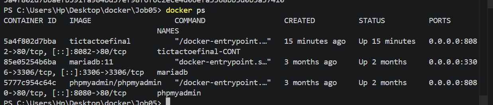

# TP Docker – Tic Tac Toe & Volumes

---

## Partie 1 — Création du projet Tic Tac Toe

### Étape 1 — Création des fichiers du projet

Création des fichiers nécessaires au fonctionnement du projet :

- `index.html`
- `save.php`
- `results.json`
- `Dockerfile`



---

### Étape 2 — Création du fichier `index.html`

Création de l’interface du jeu Tic Tac Toe avec HTML, CSS et JavaScript.



---

### Étape 3 — Création du fichier `save.php`

Création du fichier PHP permettant de sauvegarder les résultats des parties dans `results.json`.



---

### Étape 4 — Création du fichier `results.json`

Création du fichier JSON qui stockera les résultats des parties.



---

### Étape 5 — Création du Dockerfile

Création du fichier `Dockerfile` basé sur l’image officielle `php:8.2-apache`.



---

# 🐳 Partie 2 — Construction et exécution du conteneur

### Étape 1 — Build de l’image Docker

Construction de l’image Docker à partir du Dockerfile.



---

### Étape 2 — Création du volume Docker

Création du volume `game-results` pour sauvegarder les résultats du jeu.



---

### Étape 3 — Lancement du conteneur

Démarrage du conteneur avec :

- exposition du port 80
- accès depuis le port 8080
- liaison du volume Docker



---

### Étape 4 — Vérification du conteneur actif

Affichage des conteneurs en cours d’exécution.



---

### Étape 5 — Accès au jeu dans le navigateur

Accès au jeu Tic Tac Toe via :

```text
http://localhost:8080
```
