# TP Docker — Application Multi-Conteneurs avec Docker Compose

---

## Partie 1 — Création de l’environnement Docker

### Étape 1 — Création de la structure du projet

Création des dossiers et fichiers nécessaires pour le backend, le frontend et la configuration Nginx.

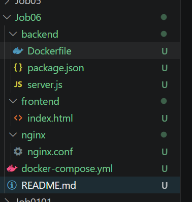

### Étape 2 — Création du fichier `docker-compose.yml`

Création du fichier `docker-compose.yml` contenant les 4 services :

- MySQL
- Backend Node.js
- Frontend Nginx
- Adminer

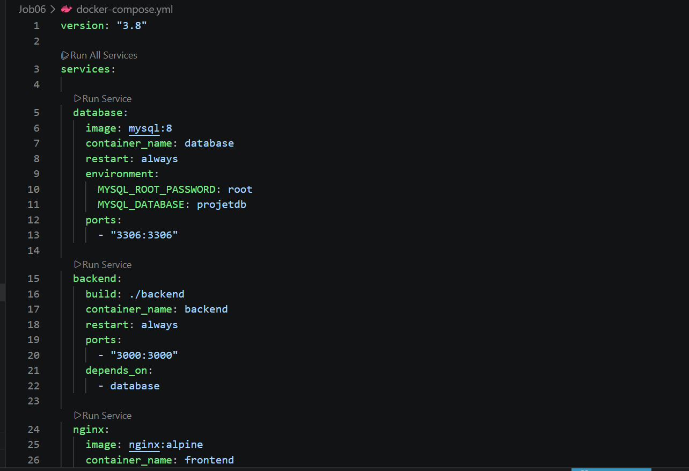
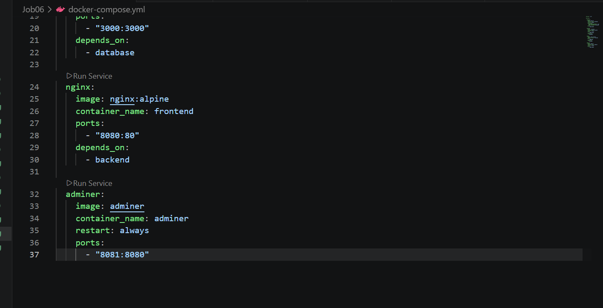

### Étape 3 — Création du Dockerfile du backend

Création du fichier `Dockerfile` pour le backend Node.js.

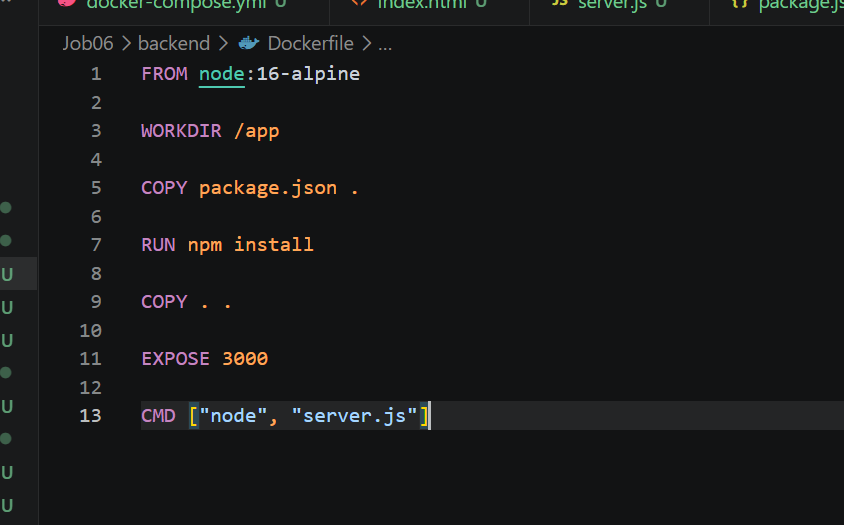

### Étape 4 — Création du fichier `server.js`

Création du backend Node.js permettant la connexion à la base de données MySQL et la création des routes API.

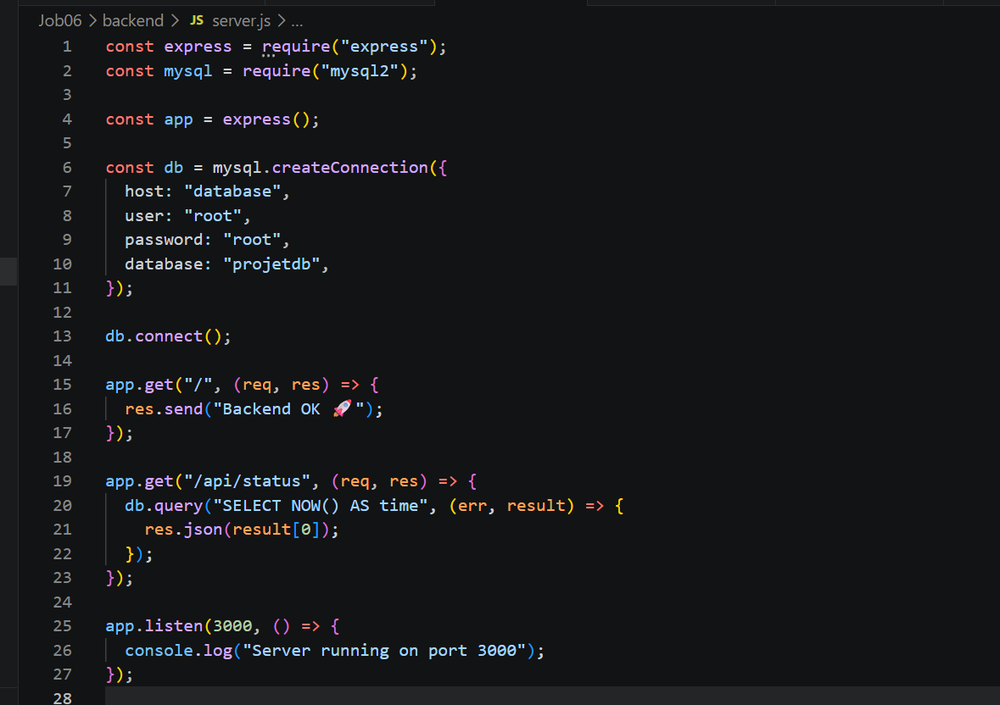

### Étape 5 — Création du frontend

Création du fichier `index.html` permettant d’afficher le statut de l’API.

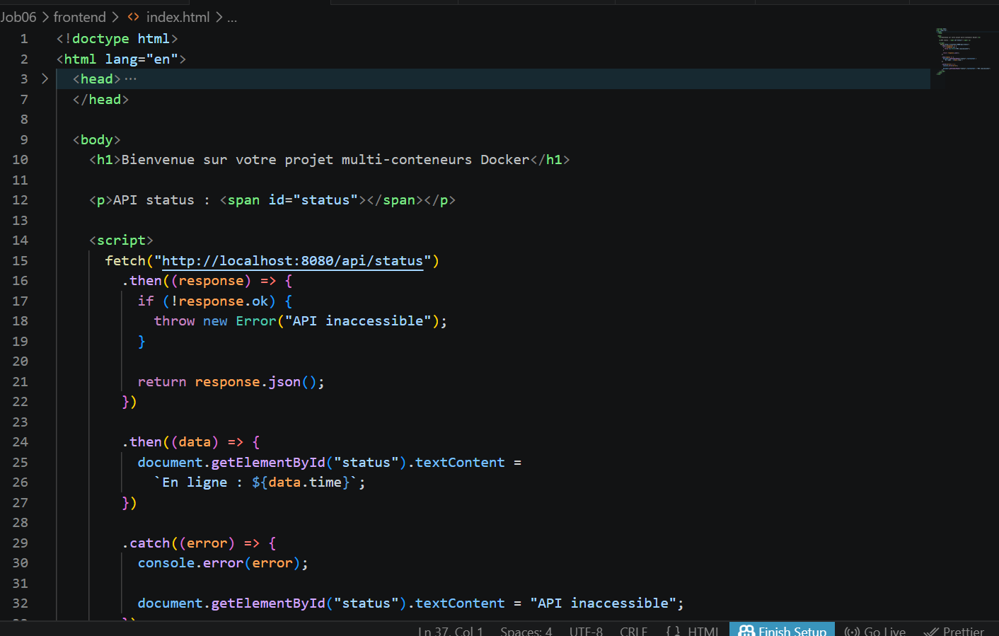

### Étape 6 — Création du fichier `nginx.conf`

Configuration du serveur Nginx pour servir le frontend et communiquer avec le backend.

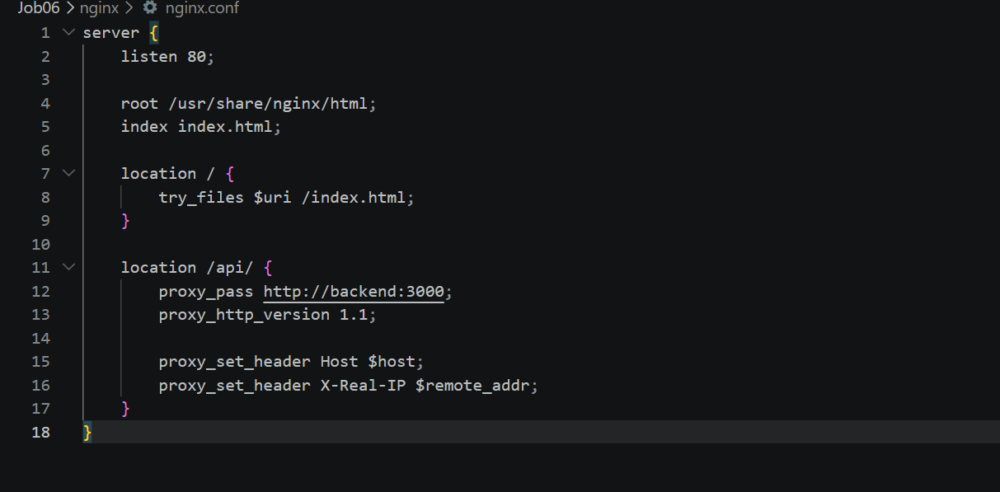

---

# Partie 2 — Lancement des conteneurs Docker

### Étape 1 — Build et lancement des services

Construction et démarrage des conteneurs avec Docker Compose.

```bash
docker compose up --build
```

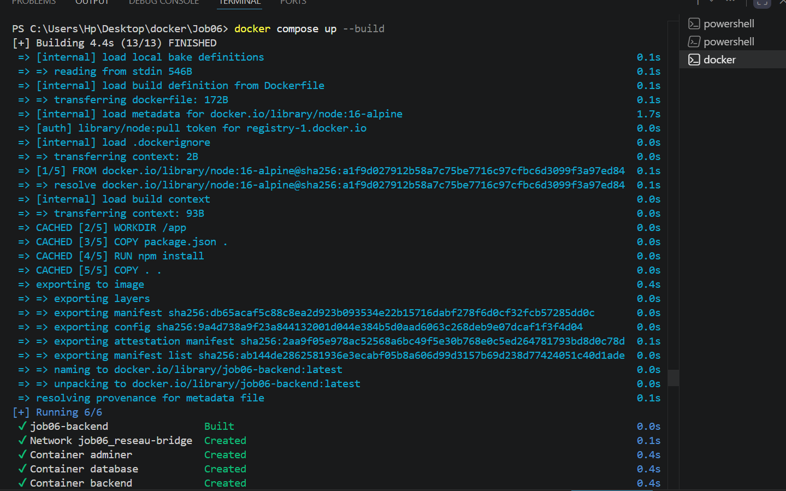

### Étape 2 — Vérification des conteneurs actifs

Affichage des conteneurs actifs pour vérifier le bon fonctionnement des services.

```bash
docker ps
```

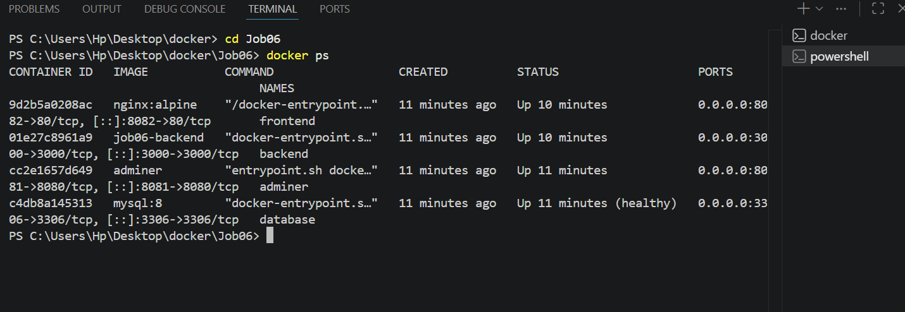

---

### Étape 3 — Accès au frontend

Accès à l’application frontend via :

```text
http://localhost:8082
```

Affichage du statut de l’API.

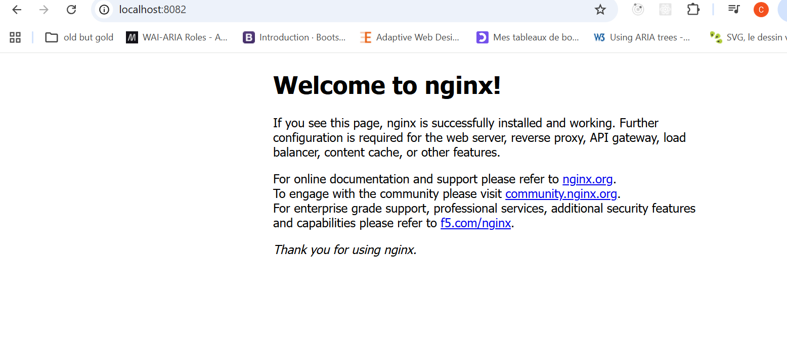

---

### Étape 4 — Accès au backend

Accès au backend via :

```text
http://localhost:3000
```

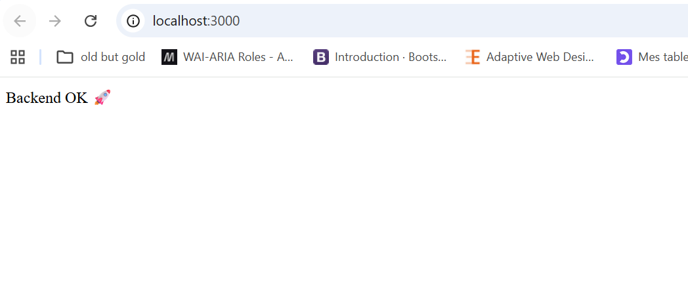

---

### Étape 5 — Accès à Adminer

Connexion à Adminer via :

```text
http://localhost:8081
```

Informations de connexion :

```text
Serveur : database
Utilisateur : root
Mot de passe : root
Base de données : projetdb
```

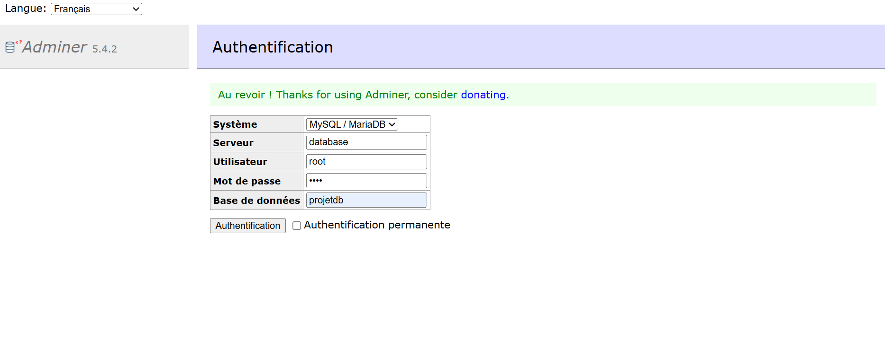

---

### Étape 6 — Vérification de la base de données

Connexion réussie à la base de données MySQL depuis Adminer.

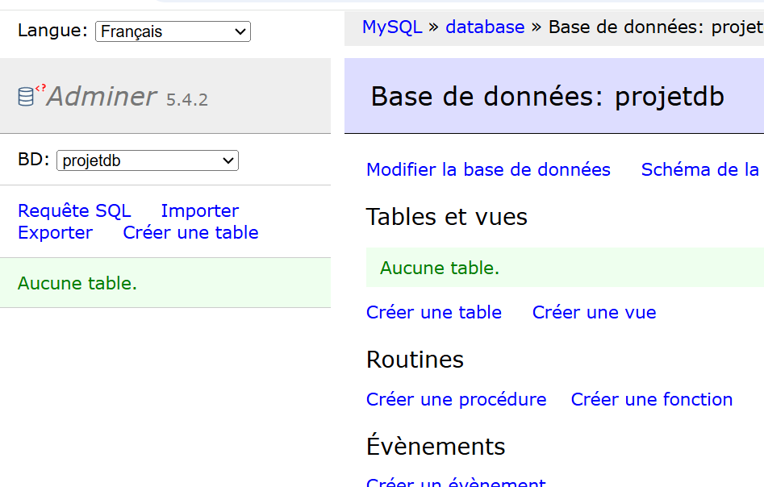

---

### Étape 7 — Connexion au conteneur MySQL

Connexion au shell MySQL depuis le terminal Docker.

```bash
docker exec -it database mysql -u root -p
```


---

### Étape 8 — Vérification du réseau Docker

Affichage des réseaux Docker créés automatiquement par Docker Compose.

```bash
docker network ls
```

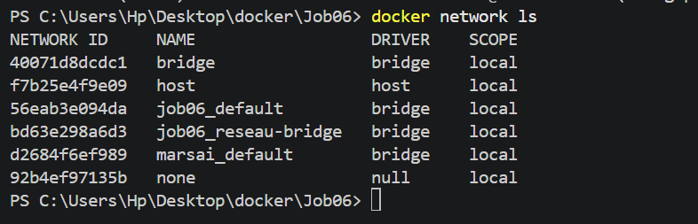

---

### Étape 9 — Arrêt des conteneurs

Arrêt des services Docker Compose.

```bash
docker compose down
```

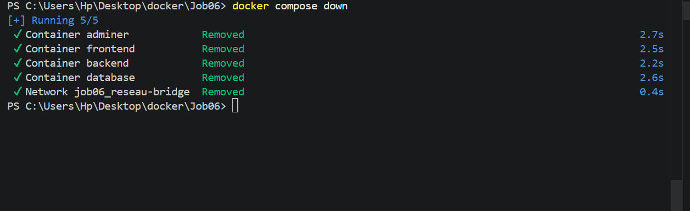
